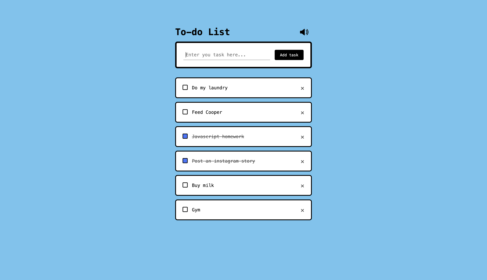
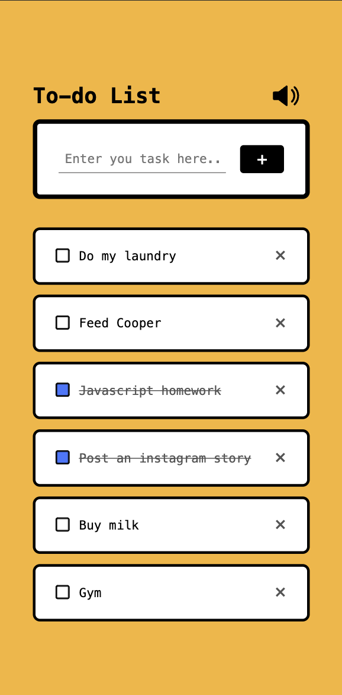

# To-do List

Just a simple to-do list app that allows me to practice what I learned and have a tool that I can use regularly. 

[link to the app](https://kazmakai.github.io/todo-list/)




## Features
- Enter tasks
- check and uncheck tasks
- Auto-saved in local storage
- Sound effects that can be toggled on/off

## Technologies
1. HTML
2. CSS
3. JavaScript

## Approach
I designed and develop this based on my personal preference; something that has a minimalistc user interface, is quick and snappy, and doesn't have a bunch of unnecessary customizations that I generally don't need. Just like a piece of scrap paper you write your shopping list on except it's digital. 

A to-do list is probably the most common basic app people will build and there are many ways to tackle it. For me, I prefer to first build the basic HTML and CSS of the app before establishing the interactive components, mainly the buttons in this case. 

There are only 2 main functions to this app: add/delete tasks and check/uncheck tasks. 

```javascript
// add and delete tasks
function addTask() {
  if (inputField.value === "") {
    alert("You need to enter something.");
  } else {
    soundEffect.src = "./audio/Add.mp3"
    soundEffect.play(); 
    let list = document.createElement('li')
    list.innerHTML = inputField.value; // transferring inputField text to the list
    listContainer.appendChild(list); // display the list using the listContainer
    let span = document.createElement('span');
    span.innerHTML = "\u00d7";
    list.appendChild(span);
  }
  inputField.value = ""; // clears the inputField when button is clicked
  saveData();
};

// check and uncheck tasks
function checkTask(event) {
  if (event.target.tagName === 'LI') { // making toggle
    event.target.classList.toggle('checked');
    if (event.target.classList.contains('checked')) { //
        soundEffect.src = "./audio/checked.mp3"
        soundEffect.play(); 
      }
    saveData();
  } else if (event.target.tagName === "SPAN") {
    soundEffect.src = "./audio/delete.mp3"
    soundEffect.play(); 
    event.target.parentElement.remove();
    saveData();
  }
}
```
To exercise my knowledge of DOM, I used it to manipulate CSS and HTML to create new list elements as opposed to using another popular way of first creating an empty list items in HTML. 

Once the main functions have been built, I added some accessories like sound effects, sound on/off button, adjusted the media query so it looks better on mobile, and saving the data to local storage.

## Retrospective
Even thoughh this is a seemingly simple app, it did give me a decent challenge and I learned a handful of skills from it. Moving forward, I'd like to first fix a bug where the mute button svg disappears on click before adding a tasks edit feature. 

## Status
Version 1.0
Further development to be made.

## Credits
- My instructors from GA: Joel and CJ
- Random people on forums such as Stack Overflow and Github